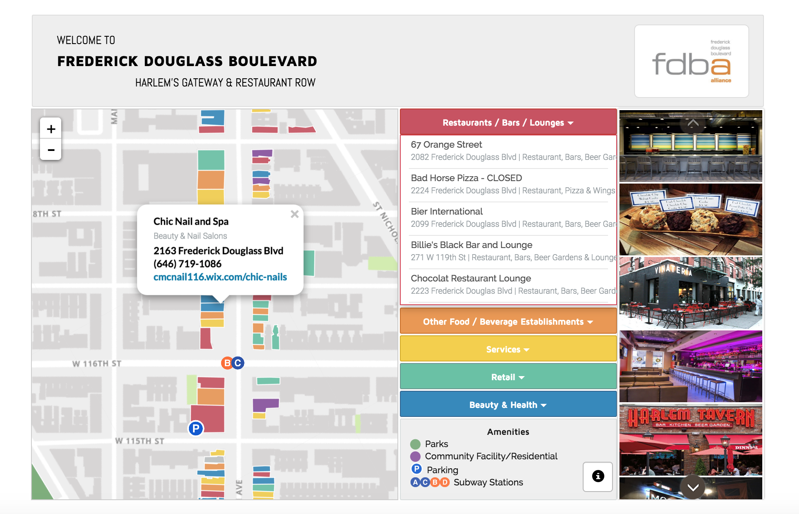

## Responsive Interactive Map for Frederick Douglass Boulevard
### Harlem's Gateway & Restaurant Row

Using rotated leaflet map with bootstrap components and slider effects

<kbd></kbd> 

###[Demo](https://livenlulu.github.io/fdba/debug/rotate/fdbs.html)